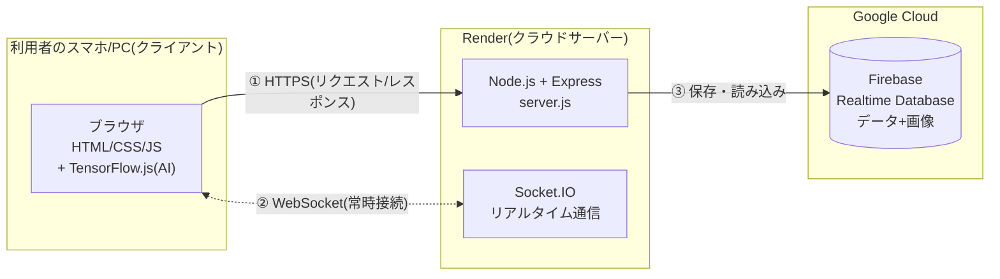
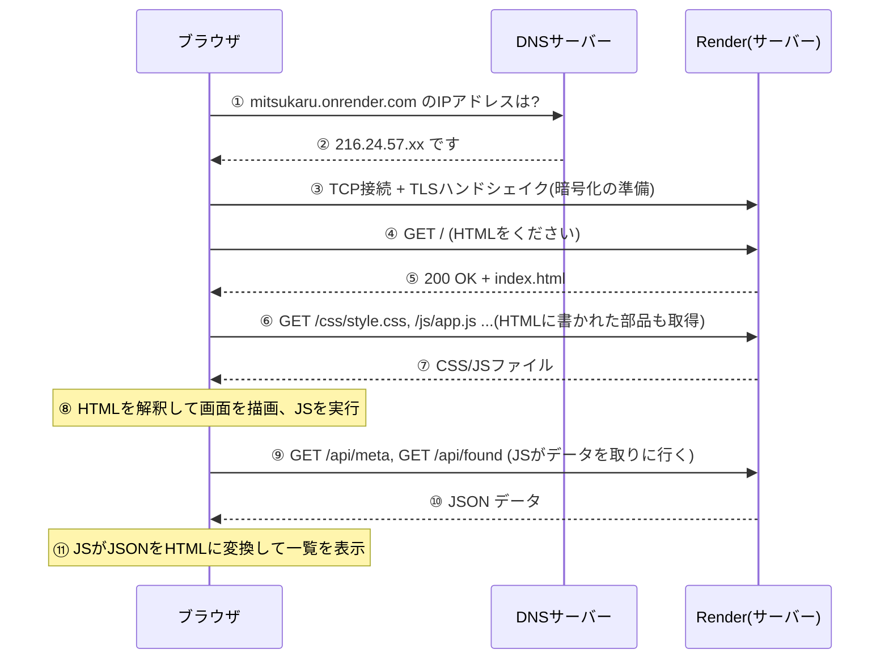
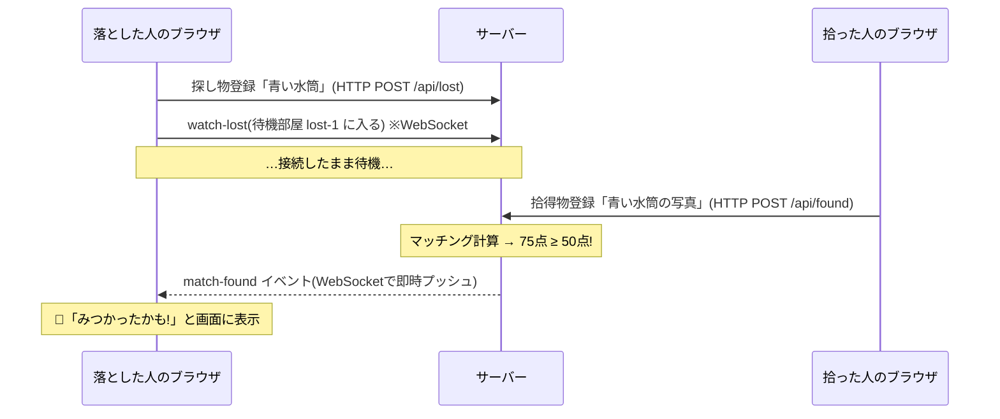
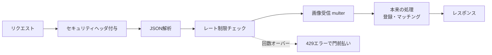
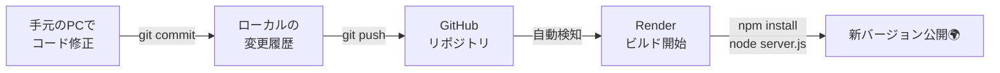
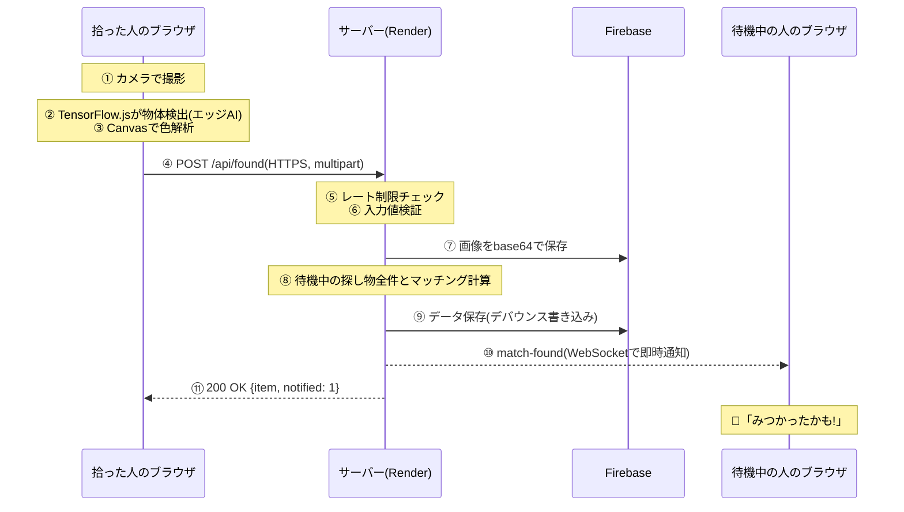

# 📗 第2巻: インターネットの仕組みとシステム構成

このドキュメントは「ブラウザで `https://〜.onrender.com` を開いてから画面が表示されるまでに、
**裏側で何が起きているのか**」を、みつかる君を題材に解説する教科書です。

---

## 1. 全体構成図

みつかる君は3つの場所のコンピュータが協力して動いています。



| 場所 | 役割 | 例えるなら |
|---|---|---|
| クライアント(ブラウザ) | 画面表示・AI画像認識・入力 | お客さん |
| サーバー(Render) | マッチング計算・データの窓口・通知の配達 | お店の店員 |
| データベース(Firebase) | データの永続保存 | お店の倉庫 |

---

## 2. URLを開いてから画面が出るまで(ページ表示の旅)

`https://mitsukaru.onrender.com/` を開いたとき、約1秒の間にこれだけのことが起きています。



### 各ステップの解説

1-2. **DNS(Domain Name System)** — インターネットの「電話帳」。
人間が覚えやすい名前(ドメイン名)を、コンピュータが使う住所(IPアドレス)に変換する仕組み。

3. **TCP/TLS** — TCPはデータを「正確に・順番通りに」届ける約束事。
TLSはその上で通信を**暗号化**する(`https://` の `s` はこれ)。
途中の経路で誰かが盗み見ても、暗号文しか見えない。

4-5. **HTTP(HyperText Transfer Protocol)** — 「リクエスト(要求)→レスポンス(応答)」を繰り返す会話のルール。
ブラウザが `GET /` と頼むと、サーバーが `200 OK` と一緒にHTMLを返す。

9-11. **API通信** — 最初のHTMLは「枠」だけ。中身のデータはJavaScriptが後から
APIに取りに行き、受け取ったJSONを画面に組み立てる。この方式により
「画面(見た目)」と「データ」を分けて管理できる。

---

## 3. HTTPをもう少し詳しく

### リクエストの中身(実物)

ブラウザがみつかる君に検索を頼むとき、実際にはこんなテキストが送られています。

```
GET /api/found?q=青い水筒 HTTP/1.1        ← メソッド + パス + バージョン
Host: mitsukaru.onrender.com              ← どのサイト宛か
Accept: application/json                  ← JSONがほしい
```

### レスポンスの中身(実物)

```
HTTP/1.1 200 OK                           ← ステータス(成功)
Content-Type: application/json            ← 中身はJSONだよ
X-Content-Type-Options: nosniff           ← セキュリティヘッダ

{"query":"青い水筒","results":[{"id":2,"category":"bottle",...}]}
```

### HTTPメソッド(動詞)

| メソッド | 意味 | みつかる君での例 |
|---|---|---|
| `GET` | データをください(読むだけ) | 検索、統計、履歴の取得 |
| `POST` | データを送るので処理して(変更を伴う) | 拾得物の登録、返却記録 |

### ステータスコード(返事の種類)

| コード | 意味 | みつかる君での例 |
|---|---|---|
| `200` | 成功 | 検索成功 |
| `400` | あなたのリクエストが変です | カテゴリ未選択、8MB超の画像 |
| `401` | 認証が必要です | PINが間違っている |
| `404` | そんなものはありません | 存在しないIDの拾得物 |
| `429` | 頼みすぎです | レート制限に引っかかった |
| `500` | サーバー側でエラーが起きました | 予期しないバグ |

---

## 4. WebSocket — 「届いた瞬間に通知」の仕組み

### HTTPだけでは通知できない

HTTPは必ず「クライアントから」話しかけるルールです。
サーバーから「新しい落とし物が届いたよ!」と**自分から**言うことができません。

昔ながらの解決策は「ポーリング」= 数秒ごとに「何かあった? 何かあった?」と聞き続ける方法。
無駄な通信が多く、リアルタイム性も低い。

### WebSocketは「電話をつなぎっぱなし」

WebSocketは、最初にHTTPで挨拶した後、**接続を切らずに保ち**、
双方向にいつでもメッセージを送れるようにする技術です。



みつかる君では **Socket.IO** というライブラリを使っています。
Socket.IOはWebSocketを使いやすく包んだもので、「部屋(room)」機能により
**マッチした本人にだけ** 通知を送れます(`lost-1` の部屋には探し物1番の人だけがいる)。

---

## 5. エッジAI — ブラウザの中で動く画像認識

### 普通のAIサービスとの違い

| 方式 | 画像の行き先 | 費用 | プライバシー |
|---|---|---|---|
| クラウドAI(一般的) | 画像をサーバーやAI業者に送って解析 | API料金がかかる | 画像が外部に渡る |
| **エッジAI(みつかる君)** | **ブラウザの中**で解析。生画像の解析結果だけ使う | 無料 | 解析自体は端末内で完結 |

### 仕組み

1. ページを開くと **TensorFlow.js**(ブラウザで動く機械学習ライブラリ)が
   **COCO-SSD** という学習済みモデル(数MB)をダウンロード
2. 写真を撮ると、ブラウザのJavaScriptがモデルに画像を入力
3. モデルが「bottle 92%」のように **80種類の物体** を検出
4. 同時に Canvas(描画API)で画像のピクセルを数えて **主要な色** を計算
5. 結果をフォームに自動入力 → 人間が確認して送信

> **COCO-SSD**: COCOという大規模画像データセットで訓練された物体検出モデル。
> SSD (Single Shot MultiBox Detector) は「1回の計算で位置と種類を同時に当てる」高速な方式。

---

## 6. サーバーの中身 — Node.js と Express

### Node.js とは

JavaScriptを **ブラウザの外**(サーバー)で動かすための実行環境。
「フロントもバックも同じ言語で書ける」のが強み。

### Express とは

Node.jsでWebサーバーを簡単に作るためのフレームワーク。
「このURLに来たらこの関数を実行する」という**ルーティング**を宣言的に書けます。

```js
// 「GET /api/stats に来たら統計を返す」をこれだけで書ける
app.get('/api/stats', (req, res) => {
  res.json({ total: 10, returned: 7 });
});
```

### ミドルウェア — リクエストが通る関所

Expressの重要な概念。リクエストは目的の処理に届く前に、複数の「関所」を順に通ります。



みつかる君のレート制限も、この「関所」として実装されています
(IPアドレスごとに直近1分の回数を数え、超えたら429を返す)。

---

## 7. データベース — Firebase Realtime Database

### なぜデータベースが必要か

Renderの無料プランは、サーバーが再起動するたびに**ファイルが消えます**(エフェメラル=揮発性)。
そこでデータは外部のデータベース(Firebase)に預けます。

### Firebase Realtime Database とは

Googleが提供する **NoSQL型** のクラウドデータベース。
データ全体が1つの大きな **JSONツリー** として保存されます。

```
mitsukaru/                      ← ルートノード(FIREBASE_ROOT)
 ├─ data/
 │   ├─ foundItems/            ← 拾得物の配列
 │   ├─ lostRequests/          ← 探し物の配列
 │   └─ seq/                   ← 連番ID管理
 └─ images/
     └─ found_1718...jpg/      ← 画像(base64文字列で保存)
```

### みつかる君での使い方(設計の工夫)

- **起動時に全データをメモリへ読み込み**、普段の検索・マッチングはメモリ上で高速に処理
- データに変更があったら**1秒待ってからまとめて書き込み**(デバウンス)
  → 連続登録のたびに毎回通信せず、効率的
- 画像は **base64**(バイナリを文字列に変換する方式)でDBに保存し、
  一度読んだ画像はメモリにキャッシュ

### 認証 — サービスアカウント

サーバーがFirebaseに接続するときは「**サービスアカウント鍵**」(JSONファイル)で本人確認します。
これは人間のパスワードに相当する機密情報なので:

- `.gitignore` に登録して **絶対にGitHubへ上げない**
- 本番(Render)では **環境変数** として安全に渡す

---

## 8. デプロイ — 作ったものを世界に公開する仕組み

### 登場人物

| サービス | 役割 |
|---|---|
| **Git** | コードの変更履歴を記録するバージョン管理ツール |
| **GitHub** | Gitのリポジトリをインターネット上に置く保管庫 |
| **Render** | GitHubのコードを自動で動かしてくれるPaaS(クラウド) |

### 自動デプロイの流れ(CI/CDの入り口)



`git push` するだけで、数分後には世界中からアクセスできるURLが最新版になります。
この「pushしたら自動で公開」の仕組みを **継続的デプロイ(CD)** と呼びます。

### render.yaml(Blueprint)

「どんな環境で、どのコマンドで動かすか」を書いた設計図。
**Infrastructure as Code**(サーバー設定もコードで管理する)という現代的な考え方です。

---

## 9. 1回の「拾得物登録」で起きること(総まとめ)

ここまでの知識を全部つなげると、写真を1枚登録したとき裏側ではこう動いています。



たった1回のボタン押下の裏で、**3つのコンピュータ・5種類以上の技術**が連携しています。
